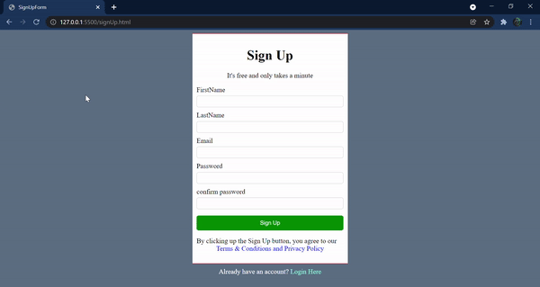

**signupform** : :jack_o_lantern:
A web app that is built with **HTML5,CSS3 & Vanilla JAVASCRIPT**  

> Note : The project is still build with pure javascript. No libraries used.

## Table of contents
- [General Info](#General-Info-)
- [Preview](#preview-)
- [Installation](#Installation-)
- [Technologies](#Technologies-Used-)

## 1. General Info 📝
The purpose of this project is to understand and implement the javascript concepts that i've learned to make the user interface look appealing besides having fun along the journey :smiley:.

## 2. Preview 🎥


## 3. Installation 📀

#### Clone the repo

```sh
$ git clone https://github.com/preetamvarun/css_signupForm.git
$ cd css_signupForm/
```

#### Run the app
```sh
open signUp.html with a browser you prefer
```
## 4.Technologies Used ✳️

[](https://devdocs.io/javascript/)   
[](https://devdocs.io/html/)   
[](https://devdocs.io/css/)   

